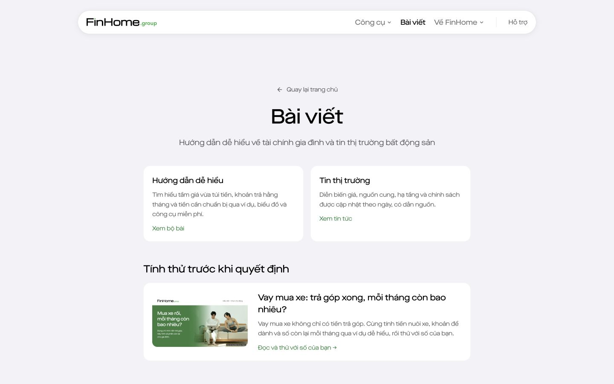
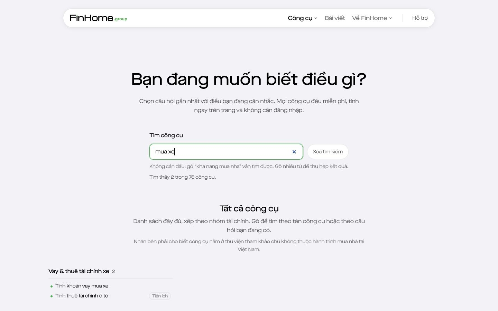
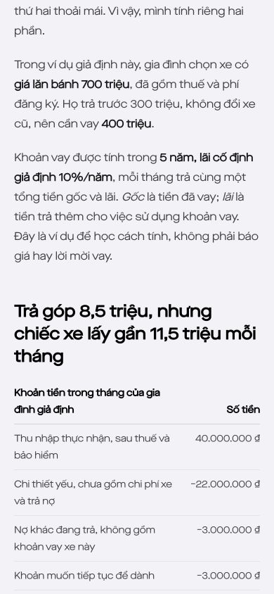
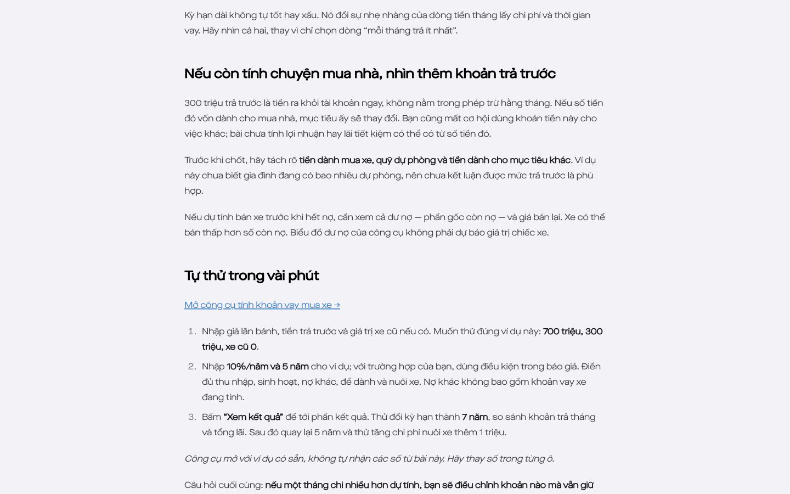
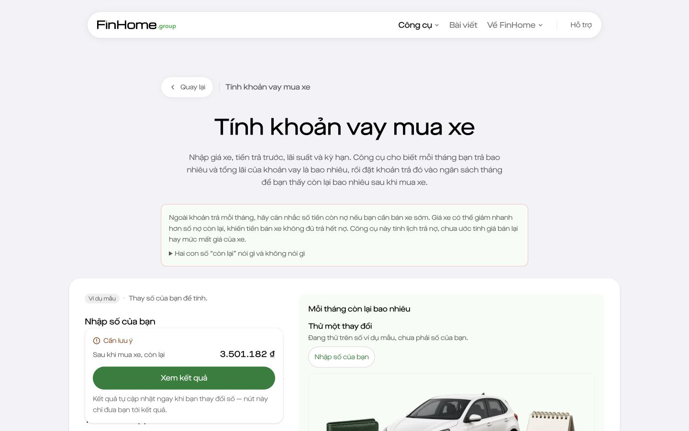
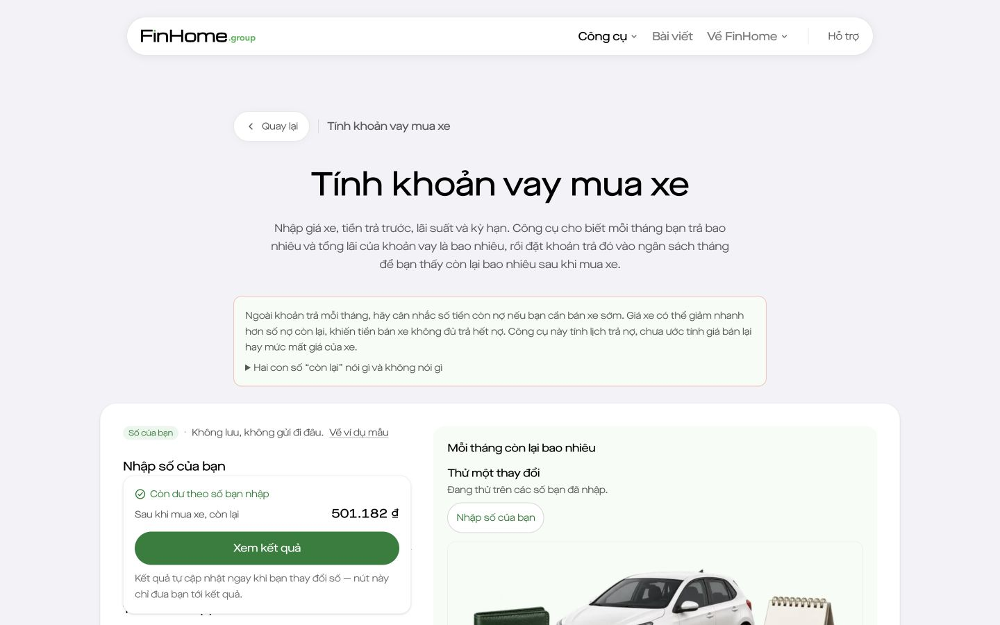
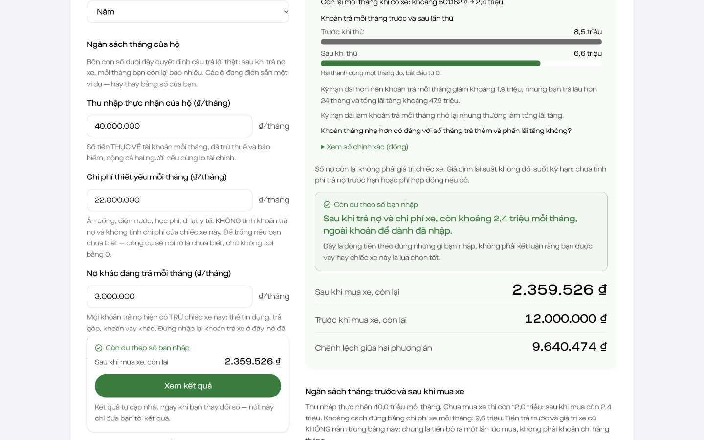
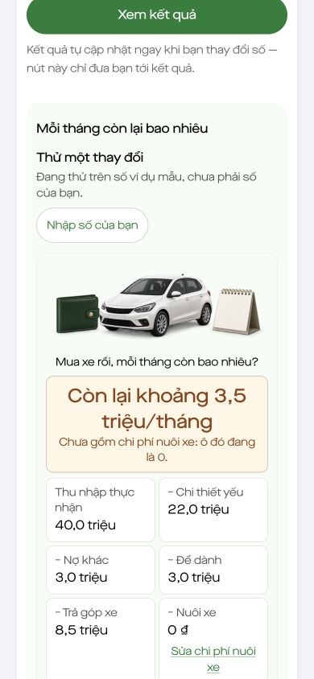
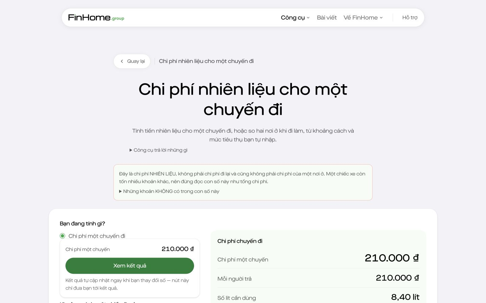
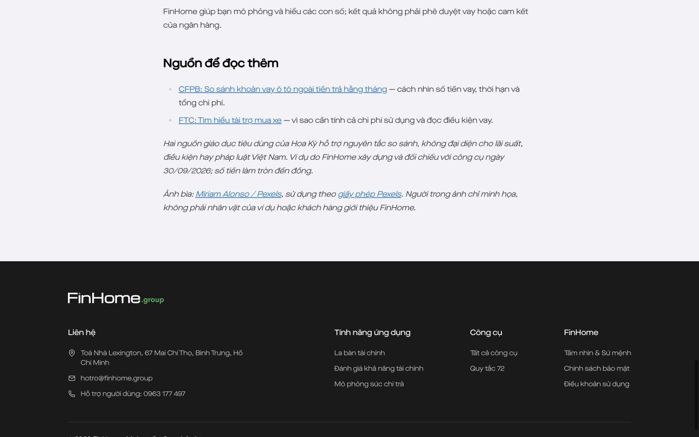

# Review hành trình bài viết → công cụ vay mua xe

## Kết luận

Bài giúp người đọc hiểu đúng câu hỏi “mua xe rồi còn bao nhiêu mỗi tháng”. Công cụ có tương tác tốt để tự thử. Khoảng trống chính nằm ở việc nối hai trải nghiệm: kết quả ban đầu khác ví dụ trong bài, thiếu đường đọc ngược từ công cụ, và mất dữ liệu khi đi sang công cụ phụ rồi quay lại.

Đây là review bản build local đang chạy tại `http://127.0.0.1:3251`, ngày 30/09/2026. Source base `85845f57c50badad7b11943a0703d030861b784d`, có thay đổi bài viết chưa commit. Không phải xác nhận đã phát hành hoặc đã kiểm thử production. Không sửa source sản phẩm trong lượt review này.

## Bản đồ điều hướng hiện tại

```text
Menu Bài viết → /blog/
  ├─ Hướng dẫn dễ hiểu → Mua nhà bằng con số (không chứa bài mua xe)
  ├─ Tính thử trước khi quyết định → Bài mua xe
  │    ├─ Công cụ nhiên liệu (xuất hiện trước CTA chính)
  │    ├─ Công cụ vay mua xe (ví dụ mặc định khác bài)
  │    └─ Công cụ lãi thả nổi
  └─ Tin thị trường

Menu/danh sách công cụ → tìm “mua xe” → Công cụ vay mua xe
  ├─ Nhập số → xem kết quả → thử thay đổi → hoàn tác
  ├─ Thuê tài chính ô tô
  ├─ Chi phí nhiên liệu → các nhánh mua nhà; không có đường trực tiếp về vay xe
  └─ “Quay lại” → danh sách công cụ, không phải bài trước đó

Công cụ vay mua xe ── chưa có liên kết ngữ cảnh ──→ Bài mua xe
Đi sang nhiên liệu → browser Back → số vay xe trở về ví dụ mặc định
```

Social/SEO có thể là điểm vào trực tiếp của bài, nhưng lượt này không kiểm thử bài đăng social, thứ hạng tìm kiếm hoặc preview chia sẻ.

## Các bước đã kiểm tra

### 1. Tìm bài hoặc tìm công cụ — dùng được, nhãn phân loại cần rõ hơn

Ở 1440×900, trang Bài viết có thẻ bài mua xe trong vùng “Tính thử trước khi quyết định”. Bấm thẻ mở đúng bài. Tuy nhiên, lựa chọn “Hướng dẫn dễ hiểu” phía trên chỉ dẫn tới bộ bài mua nhà. Người muốn học về mua xe có thể chọn nhầm nhánh vì nhãn rộng hơn nội dung đích.

Danh sách công cụ: tìm “mua xe” trả về công cụ vay mua xe và thuê tài chính ô tô. Không cần thêm một hub mới chỉ để phục vụ bài này.





### 2. Đọc và hiểu ví dụ — tốt

Mở bài có tình huống cụ thể; tách tiền trả trước khỏi chi phí tháng; giải thích phần còn lại đã trừ khoản để dành. Bảng và sơ đồ cùng một ví dụ. So sánh 5–7 năm nêu cả khoản trả tháng lẫn tổng lãi, không chỉ chọn khoản trả thấp. Phần liên hệ mục tiêu mua nhà phù hợp đối tượng FinHome nhưng không ép người chỉ muốn tính xe vào hành trình mua nhà.

Hero đẹp và đúng bộ nhận diện đang dùng, nhưng trên laptop gần hết màn hình đầu là tiêu đề và ảnh; chưa có hành động tính nhanh. Trên mobile, chữ trong ảnh bìa nhỏ và lặp ý tiêu đề; không nên dùng ảnh xuất cho social làm vật mang thông tin quan trọng duy nhất trên web.




### 3. Từ bài sang tính thử — liên kết chạy đúng, chuyển ngữ cảnh chưa liền

CTA chính là một text link trong mục “Tự thử trong vài phút”, ở khoảng y=3865px trên laptop và y=4936px trên mobile. Đây là vị trí DOM quan sát được, không phải đo thời gian hay tỷ lệ rời trang. Không có CTA tính xe ở đầu bài. Liên kết nhiên liệu xuất hiện sớm hơn CTA chính.

Mở công cụ từ bài cho ví dụ mặc định: xe 800 triệu, trả trước 300 triệu, xe cũ 100 triệu, nuôi xe 0. Bài dùng xe 700 triệu, trả trước 300 triệu, xe cũ 0, nuôi xe 3 triệu. Cùng vay 400 triệu nhưng phần còn lại là 3.501.182 ₫ so với 501.182 ₫ trong bài. Không phải lỗi tính: đó là hai bộ đầu vào khác nhau. Bài có báo trước việc phải nhập lại, nhưng người dùng vẫn phải nhớ và thay nhiều số.

Đề xuất: đặt CTA sớm “Tính với số của tôi”, và CTA tại ví dụ “Thử đúng ví dụ này”. Dùng mã ví dụ công khai để khởi tạo bộ giả định; không đưa thu nhập hoặc số tài chính cá nhân vào URL. Cần kiểm tra hành vi với dữ liệu người dùng đang nhập để không tự ghi đè.





### 4. Tính và so sánh — tốt, bài chưa tận dụng đủ tương tác hiện có

Đã nhập xe 700 triệu, xe cũ 0 và nuôi xe 3 triệu; các số còn lại khớp ví dụ. Kết quả còn lại 501.182 ₫. Nút “Xem kết quả” dẫn tới vùng kết quả sau khi cuộn hoàn tất.

Đã bấm “Kéo dài kỳ hạn thêm 2 năm”: công cụ hiển thị 5→7 năm, khoản trả khoảng 8,5→6,6 triệu, tổng lãi khoảng 109,9→157,8 triệu, phần còn lại khoảng 0,5→2,4 triệu và giải thích đánh đổi. Có nút hoàn tác; lượt này quan sát sự hiện diện, không kiểm thử nút hoàn tác.

Bài hiện hướng dẫn sửa kỳ hạn rồi quay lại 5 năm bằng tay. Nên hướng dẫn dùng đúng nút thử và hoàn tác để người đọc nhìn được so sánh trước–sau, không phải tự nhớ.







### 5. Đi tính nhiên liệu rồi quay lại — đứt mạch

Đã theo liên kết “Chi phí nhiên liệu” từ công cụ vay xe. Trang đích mặc định tính một chuyến 120km, số chuyến/tháng 0; không tự trở thành phép tính chi phí nuôi xe hằng tháng. Các bước tiếp theo của trang nhiên liệu hướng sang khả năng mua nhà và thuê/mua nhà; không có nhánh trực tiếp quay về khoản vay xe.

Sau khi thử kỳ hạn 7 năm, sang nhiên liệu rồi browser Back, các ô vay xe trở lại 800 triệu / 300 triệu / xe cũ 100 triệu / 5 năm / nuôi xe 0. Dữ liệu đã thử không được giữ trong vòng điều hướng này. Đã kiểm tra từ UI và giá trị các ô sau Back, không suy luận từ việc thiếu một nút lưu.

Đề xuất: cho tính nhiên liệu trong một nhánh phụ mà không làm mất form đang làm; hoặc bảo toàn trạng thái tạm thời khi quay lại. Ưu tiên trạng thái trong phiên hiện tại, không tự thêm lưu lâu dài/tài khoản/đồng bộ. Nếu chọn lưu trên thiết bị phải cập nhật đúng thông báo “không lưu” hiện tại và làm rõ thời hạn/xóa dữ liệu. Cần cộng bảo hiểm, đỗ xe, bảo dưỡng riêng; tiền nhiên liệu không phải toàn bộ chi phí nuôi xe.



### 6. Đọc lại hoặc quyết định bước tiếp — thiếu liên kết ngữ cảnh

Trong phần main của công cụ vay xe chỉ có ba liên kết: danh sách công cụ, thuê tài chính ô tô và nhiên liệu. Không có bài giải thích này. “Quay lại” là nhãn nhìn thấy nhưng đích thực là danh sách, dễ khác với kỳ vọng quay về bài vừa đọc; tên truy cập của liên kết đã nói rõ danh sách.

Bài kết thúc bằng nguồn và ghi nhận ảnh; không có một CTA tính thử lặp lại cuối bài hoặc bài cùng loại liên quan (hiện chỉ có một guide). Đây không phải yêu cầu thêm nhiều CTA: thêm một điểm trở lại tính toán đủ rõ sau phần đối chiếu là đủ.

Đề xuất thêm “Xem cách đọc kết quả qua ví dụ” từ công cụ về bài. Đổi nhãn “Quay lại” thành “Tất cả công cụ”; chỉ hiện “Trở lại bài đang đọc” khi thật sự có ngữ cảnh đó. Không thêm nút tải app hoặc cam kết lưu/chuyển dữ liệu nếu chưa có chức năng tương ứng.



## Thứ tự đề xuất

1. Nối đúng ví dụ bài → công cụ; giữ riêng lựa chọn nhập số của mình.
2. Giữ mạch tính nhiên liệu → quay về vay xe, không mất dữ liệu đang làm.
3. Thêm liên kết hai chiều bài ↔ công cụ và làm rõ đích “Quay lại”.
4. Đưa CTA tính xe lên sớm, nhắc lại sau kết luận; hướng dẫn các nút thử thay đổi hiện có.
5. Làm rõ nhãn bộ bài mua nhà; giữ ảnh là hỗ trợ, không phụ thuộc chữ nhỏ trong ảnh trên mobile.

## Luồng đề xuất

```text
Tôi chưa hiểu → Bài giải thích → Thử đúng ví dụ → Hiểu kết quả
Tôi muốn tính ngay → Công cụ → Nhập số của tôi → Xem kết quả
                                             ├─ Thử thay đổi ↔ Hoàn tác
                                             ├─ Ước tính nhiên liệu ↔ Trở về với số còn nguyên
                                             └─ Xem bài giải thích ↔ Trở lại phép tính
```

Giữ hai ý định “học trước” và “tính ngay” đều hoàn thành được; không bắt người tính xe phải đọc bài hoặc chuyển sang mua nhà.

## Giới hạn và nguồn

- Đã đọc đầy đủ Markdown bài, DOM bài/công cụ, phần định nghĩa liên kết của trang vay xe và kiểm tra tương tác nêu trên. Không sửa source, không chạy lại full test suite cho tác vụ review-only.
- Kiểm tra hiển thị ở 1440×900 và 390×844. Hai bảng bài rộng 350px trong mobile 390px; không thấy tràn ngang document ở bài hoặc công cụ tại trạng thái kiểm tra. Ảnh bài tải thành công.
- Có tiêu đề, nhãn trường và text/bảng thay thế sơ đồ. Chữ nhỏ bên trong ảnh bìa trên mobile là rủi ro dễ đọc; chưa đo tương phản, kiểm thử keyboard đầy đủ hoặc screen reader. Không kết luận WCAG compliance.
- Không có quan sát người dùng thật, dữ liệu conversion hay kiểm thử tất cả trường hợp tính toán. Đây là nhận định usability có căn cứ UI, không phải chứng minh tỷ lệ hoàn thành hoặc kiểm định tài chính/pháp lý.
- Snapshot bị trắng khi cuộn đã bị loại và chụp lại trước khi dùng làm bằng chứng.
- Nguồn source: `content/posts/vay-mua-xe-con-du-bao-nhieu.md`, `app/blog/page.tsx`, `app/blog/[slug]/page.tsx`, `app/cong-cu/vay-mua-xe/page.tsx`, `components/auto-loan-calculator.tsx`, `components/calc/use-calc-fields.ts`, `components/navigation-map.test.ts`.
- Review áp dụng project skill `seo-blog` cho cách giải thích và CTA trung thực; `product-design:audit` cho screenshot-first và ranh giới chứng cứ.
